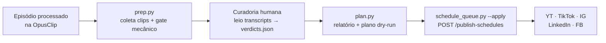

# LowOpsCast — Automação de Cortes e Distribuição Multi-Rede

Automação para transformar episódios do podcast **LowOpsCast** (YouTube [@LowOps](https://www.youtube.com/@LowOps))
em cortes verticais e distribuí-los em YouTube Shorts, TikTok, Instagram, LinkedIn e Facebook, usando
**OpusClip** (clipping por IA) + **API REST**, orquestrado por um **harness local dirigido pelo Claude Code**.

> Status: **roda 100% local** (`tools/curate/`) com **curadoria humana no meio**. O stack Azure
> (Function App, Terraform, pipelines) foi **descomissionado em 2026-09-05** — quem publica de fato é a
> API da OpusClip, chamada direto da máquina. O histórico da fase cloud fica no git.

## 1. Objetivo

Cortar cada episódio novo em ~10–15 clips e publicar/agendar nas redes respeitando a cadência ideal de
cada plataforma, com **curadoria humana de conteúdo** (payoff/insight) sobre um **gate mecânico
determinístico** — e não em piloto automático.

## 2. Descoberta-chave: são dois produtos diferentes

| | AgentOpus MCP (`api.opus.pro/api/agent-mcp`) | OpusClip REST API |
|---|---|---|
| O que faz | **Gera** vídeo do zero (text-to-video), clona voz | **Corta** vídeo longo em shorts (ClipAnything) |
| Serve para os cortes? | ❌ Não | ✅ **Sim** |
| Auth | OAuth | API Key |
| Uso no projeto | Fase 3 (capas/teasers) | Fase 2 (motor de corte) |

Ambos exigem plano **Pro+**.

## 3. Arquitetura (fluxo local)

- **Sem servidor:** tudo roda na máquina via `tools/curate/`. Não há Function, Timer nem webhook.
- **Passo 1 — `prep.py`:** puxa os clips já processados na OpusClip (`GET /api/exportable-clips`) e aplica
  o **gate mecânico** determinístico (`shared/judge.py` / `shared/clip_quality.py`): pausas/min,
  repetições, cortes de fala, duração. Sem LLM.
- **Passo 2 — curadoria humana:** leio os transcripts e escrevo `verdicts.json` (payoff/insight),
  seguindo a rubrica única em `src/shared/curation_rubric.md`.
- **Passo 3 — `plan.py`:** gera o relatório + o plano de agendamento (rede × horário × top-N via
  `shared/schedule_matrix.build_schedule_plan`) **em dry-run** — não cria nada na OpusClip.
- **Passo 4 — `schedule_queue.py --apply`:** só depois de revisar, cria os agendamentos de verdade
  (`POST /api/publish-schedules`), com ledger local `review/_queue/scheduled.json` p/ idempotência.
- **Importante:** manter o **Auto-Import nativo desligado** na OpusClip (senão clipa 2x = gasta créditos em dobro).

## 4. Dados reais das redes (jul/2026) e insights cruzados

| Rede | Alcance | Cortes funcionam? | Converte seguidor? |
|---|---|---|---|
| YouTube Shorts | 76,6 mil views (**90,9% do canal**) | 🟢 Motor principal | Fraco (+42) |
| TikTok | 40,2 mil views (For You 88,9%) | 🟢 Descoberta | Fraco (2–4/post) |
| Instagram | Reels ~4% das views | 🔴 Ruim (audiência vive em Stories) | — |
| LinkedIn | 600 mil impressões (**+119%**) | 🟡 Corte não; **artigo técnico sim** | 🟢 Autoridade |

**Insights que guiam a automação:**

1. **Priorizar YT Shorts + TikTok** para os cortes; IG secundário; LinkedIn curado.
2. **Funil:** lives convertem **~80x mais inscritos por view** que Shorts (4,49% vs 0,055%).
   → Todo corte precisa de **CTA puxando o episódio completo**.
3. **Tipo de corte que viraliza** (cross-rede): carreira (ATS, "Linux abre portas"), humor DevOps
   ("Deploy 17h59", "QA de madrugada"), tech prático (Keycloak, Terraform), curiosidade regional
   (Pomerode/Floripa). → alimentar `curationPref`/prompt do OpusClip.
4. **Audiência:** BR, tech/DevOps, masculino 25–34. Consumo: almoço (12–15h) e noite (19–22h).

### 4.1. Números por rede (referência)

- **YouTube (@LowOps):** 84,3 mil views · 1.068 inscritos · Shorts 76,6 mil (90,9%) · Lives 7,5 mil (8,9%) ·
  Vídeos 178 (0,2%). Inscritos: Lives +337, Shorts +42. Retenção Shorts 35,2%. Demografia 96,1% M, 47,5% 25–34.
  "Quando os espectadores estão online": **sem dados suficientes**.
- **TikTok:** 40,2 mil views · For You 88,9% · 1,5 mil likes · followers/post baixo (alcance sem conversão).
- **LinkedIn:** 600.713 impressões (+119% YoY) · 14.322 engajamentos (2,4%) · top = artigos técnicos do blog
  (Terraform 15k/659, lab Azure 12k/545).
- **Instagram:** 7.313 seguidores · pico 12–15h · Stories dominam · Reels ~4% das views.

## 5. Matriz de cadência (dados reais + benchmark)

| Rede | Prioridade | Cortes/ep | Horário (BRT) | Base |
|---|---|---|---|---|
| YouTube Shorts | 🥇 Primária | Todos | 12–13h e 19–21h | 90,9% do canal (dado real) |
| TikTok | 🥇 Primária | Todos | 12–13h ou 19–21h | For You 88,9% (dado real) |
| Instagram | 🥉 Secundária | Top 4–6, 1/dia | **12–15h** ✅ | Analytics real (pico 15h) + Stories |
| LinkedIn | Curado | 2–3/semana | testar 8–9h e 15–17h | Priorizar artigo > corte |
| Facebook | Baixa | opcional | 9–12h úteis | Benchmark |

> Horário **medido** só do Instagram (12–15h). O YouTube não gerou relatório de horário ("dados
> insuficientes") e o TikTok não foi coletado — para essas redes o valor é semente e o serviço
> **auto-ajusta pela performance**.

## 6. Custos

- **Plano necessário:** Pro ($29/mês) — Starter não tem scheduler, LinkedIn/Facebook, nem API/MCP.
- **Créditos:** 1 crédito = 1 min de vídeo original. Pro = 300 créditos/mês (ou anual = 3.600/ano, ~50% mais barato/crédito).
- **Publicar não gasta crédito** em nenhuma rede — exceto X (não usado).
- Episódio ~80 min ≈ 80 créditos → **~4 eps inteiros/mês no Pro base**. Recomendado: **anual** + usar
  "Processing timeframe" nos episódios de 2h+.
- Atenção: storage está em **99,39/100 GB** — limpar projetos antigos antes de processar novos.

## 7. Referência técnica (OpusClip API)

- Criar projeto: `POST https://api.opus.pro/api/clip-projects` (Bearer API_KEY), body `{ videoUrl, brandTemplateId, curationPref, conclusionActions:[WEBHOOK] }`
- Buscar clips: `GET https://api.opus.pro/api/exportable-clips?q=findByProjectId&projectId=...` (traz virality score; `id` = `{projectId}.{clipId}` → usar clipId "bare")
- Contas sociais: `GET https://api.opus.pro/api/social-accounts?q=mine`
- Agendar: `POST https://api.opus.pro/api/publish-schedules` (`publishAt` UTC ISO 8601; `subAccountId` p/ FB/IG/LinkedIn)
- Plataformas: `YOUTUBE`, `TIKTOK_BUSINESS`, `INSTAGRAM_BUSINESS`, `LINKEDIN`, `FACEBOOK_PAGE`
- Webhook: assinado HMAC-SHA256(secretKey, body+salt) — validar `X-Opus-Signature`/`Salt`/`Timestamp`
- Limites: 30 req/min core; scheduler 1 req/s; cap 900 créditos/mês de API; concorrência 4 projetos
- OpenAPI: https://help.opus.pro/api-reference/openapi.json

## 8. Execução local

Não há mais infraestrutura em nuvem. O projeto roda inteiramente na máquina:

- **Motor:** `src/shared/` (`opus_client`, `schedule_matrix`, `judge`, `clip_quality`,
  `library_report`) — a mesma biblioteca que o Function App usava, agora chamada pelos scripts de
  `tools/curate/`.
- **Dependências:** `pip install -r src/requirements.txt`. O `azure-functions` sobrou como resíduo e
  pode sair numa limpeza futura; os demais pacotes `azure-*` só entram em jogo se você reativar
  telemetria/e-mail.
- **Testes:** `cd src && PYTHONPATH=. python -m pytest -q tests/`.
- **Segredos:** `OPUSCLIP_API_KEY` no ambiente local (antes vinha de GitHub secret / app setting).
- **Notificação por e-mail (ACS):** opcional; só funciona com as credenciais ACS no ambiente.

> **Descomissionado em 2026-09-05:** removidos do repo `infra/terraform/` (Function App + FC1 + state
> remoto), `.github/workflows/ci-validate.yml`, `deploy.yml` e `src/function_app.py` (handler HTTP).
> Os recursos na Azure foram apagados manualmente. `rg-state-opus` (state remoto do Terraform) e o SP
> `sp-site-orafael` ficaram sem uso. Nada em produção — a distribuição acontece pela API da OpusClip,
> disparada localmente.

## 9. Decisões fechadas

| Decisão | Escolha |
|---|---|
| Plano OpusClip | **Pro Anual** ($290/ano — 3.600 créditos/ano, ~40 eps) |
| Linguagem | **Python 3.12+** (scripts locais) |
| LinkedIn na automação | **Sim** — 2–3 clips curados/semana |
| Notificação | **E-mail** via ACS + domínio `orafaelferreira.com` (opcional, local) |
| Storage OpusClip | Limpar projetos antigos no dashboard antes de reativar |
| Execução | **100% local** via `tools/curate/` — sem Azure, sem CI/CD |
| Curadoria | **Gate mecânico** determinístico (`shared/judge.py`) + **curadoria humana** de conteúdo; sem LLM judge |

## 10. Fluxo de trabalho (por episódio)

1. **Preparar** — `python tools/curate/prep.py …`: coleta os clips já processados na OpusClip
   (`GET /api/exportable-clips`) e aplica o gate mecânico (pausas/min, repetições, cortes, duração).
2. **Curar** — leio os transcripts e escrevo `verdicts.json` (payoff/insight real), pela rubrica em
   `src/shared/curation_rubric.md`.
3. **Planejar** — `python tools/curate/plan.py …`: relatório + plano de agendamento (rede × horário ×
   top-N) em **dry-run**. O ranqueamento (`_clip_score`) usa, em ordem de confiança: (1) **score de
   conteúdo da minha curadoria**; (2) **virality score** nativo da OpusClip, se presente (o schema
   público de `exportable-clips` não o expõe, então o código sonda nomes como `viralityScore`);
   (3) `durationMs` como proxy. Um tier superior sempre vence — corte curto e ótimo ganha de longo e raso.
4. **Agendar** — `python tools/curate/schedule_queue.py --apply …`: cria os agendamentos
   (`POST /api/publish-schedules`), com idempotência via ledger local `review/_queue/scheduled.json`.

> **Automação hands-off (RSS/Timer/webhook) foi descartada.** O modelo escolhido é curadoria humana por
> episódio — incompatível com agendar sozinho. O histórico dessa ideia (as antigas Etapas 2/3 e o
> Function App) fica no git.

## 11. Fontes (cadência)

- Hootsuite — *Best time to post 2025* (1M+ posts) e *How often to post 2025* (setor Technology).
- Buffer — *Best time to post 2026* (52M+ posts).
- Analytics próprios: YouTube Studio, Instagram, LinkedIn, TikTok (jul/2026).
